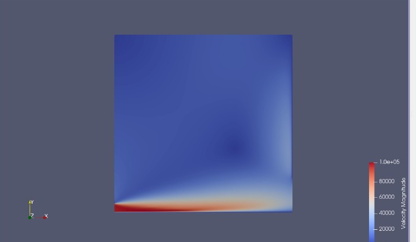

# Assignment 2: 2D Axisymmetric Turbulent Jet Simulation

## Overview  
This assignment simulates a **2D axisymmetric incompressible turbulent jet** using SU2's finite volume solver. The configuration focuses on steady-state RANS modeling with the **Spalart-Allmaras (SA)** turbulence closure to analyze jet development and mixing characteristics. Key outputs include velocity profiles and wall heat flux distributions.

---

## Configuration
### Solver Settings  
| Parameter | Value | Description |  
|-----------|-------|-------------|  
| `SOLVER` | `INC_RANS` | Incompressible Reynolds-Averaged Navier-Stokes |  
| `KIND_TURB_MODEL` | `SA` | Spalart-Allmaras turbulence model |  
| `MATH_PROBLEM` | `DIRECT` | Steady-state simulation |  
| `VISCOSITY_MODEL` | `CONSTANT_VISCOSITY` | Constant dynamic viscosity |  
| `MU_CONSTANT` | `1.853e-05` Pa·s | Air viscosity at 300K |  

### Boundary Conditions  
| Boundary | Type | Parameters |  
|----------|------|------------|  
| **Inlet** | Velocity Inlet (`INC_INLET_TYPE=VELOCITY_INLET`) |  
| - Velocity | (1.0, 0.0, 0.0) m/s (axial flow) |  
| - Temperature | 300.0 K |  
| - Pressure | 101,325 Pa (static) |  
| **Outlet** | Pressure Outlet (`INC_OUTLET_TYPE=PRESSURE_OUTLET`) |  
| - Back Pressure | 101,325 Pa (ambient) |  
| **Wall** | No-Slip + Adiabatic | `MARKER_HEATFLUX=(wall, 0.0)` |  
| **Symmetry** | Axisymmetric Condition | `MARKER_SYM=(symmetry)` |  

### Numerical Methods  
| Category | Scheme | Parameters |  
|----------|--------|------------|  
| **Gradient** | Weighted Least-Squares | `NUM_METHOD_GRAD=WEIGHTED_LEAST_SQUARES` |  
| **Flow Convection** | Flux Difference Splitting | `CONV_NUM_METHOD_FLOW=FDS` |  
| **Turbulence Convection** | Scalar Upwind | `CONV_NUM_METHOD_TURB=SCALAR_UPWIND` |  
| **Time Integration** | Implicit Euler | `TIME_DISCRE_FLOW=EULER_IMPLICIT` |  
| **Linear Solver** | FGMRES + LU-SGS Preconditioner | `LINEAR_SOLVER=FGMRES`, `LINEAR_SOLVER_PREC=LU_SGS` |  

### Convergence Criteria  
- **Max Iterations**: 4999 (`ITER=4999`)  
- **Cauchy Criteria**: 100 iterations with ε < 1e-6 (`CONV_CAUCHY_EPS=1E-6`)  
- **CFL Number**: 100 (adaptive disabled)  

---

## Computational Setup  
### Mesh Characteristics  
- **File**: `assign2mesh.su2` (structured/unstructured axisymmetric grid)  
- **Symmetry Handling**: Revolved 2D slice around x-axis  
- **Key Refinement**: Boundary layer resolution at wall/jet interface  

### Initial Conditions  
- **Density**: 1.2 kg/m³ (`INC_DENSITY_INIT=1.2`)  
- **Velocity**: (1.0, 0.0, 0.0) m/s (`INC_VELOCITY_INIT`)  

---

## Results & Visualization  
### Output Configuration  
- **Volume Output**: ParaView files (`VOLUME_FILENAME=flow`)  
- **Surface Output**: `surface_flow.csv` for wall quantities  
- **Restart Files**: Saved every 100 iterations (`OUTPUT_WRT_FREQ=100`)  

### Velocity 
  

