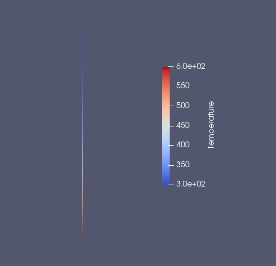
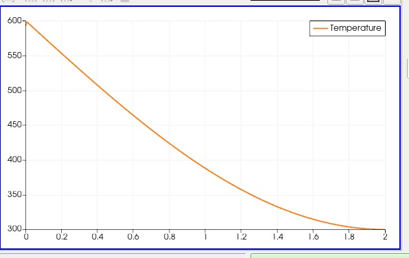

# Assignment 4: Modification of the Python Wrapper Setup

## Overview
This assignment extends the Python wrapper integration for a steady-state compressible turbulent flat plate by introducing a spatially varying wall temperature. The wall temperature is now a function of the x-coordinate, providing a more realistic simulation of the thermal boundary condition along the plate.

## Configuration
- **Solver Configuration**: The simulation uses a RANS solver with the SST turbulence model, configured for a direct mathematical problem with restart disabled.
- **Boundary Conditions**:  
  - **Wall**: The wall temperature varies spatially along the x-axis.  
  - **Inlet, Outlet, and Symmetry**: Standard boundary conditions are maintained for flow consistency.
- **Mesh Setup**: The mesh clearly distinguishes between different boundary markers such as inlet, outlet, wall, and symmetry to accurately apply the temperature variation along the flat plate.

## Code
- **Python Wrapper Implementation**:  
  The Python script is updated to compute the wall temperature as a function of the x-coordinate. The new temperature function is defined as:  
  ```python
  WallTemp = 600 - 300 * sin(x * pi / 4)
  ```
  This expression calculates a temperature distribution along the wall, where the temperature decreases as x increases.
- **Boundary Condition Update**:  
  The computed temperature from the Python wrapper is applied to the wall boundary during each iteration of the simulation, ensuring that the spatial variation is accurately captured.

## Visualization with ParaView





