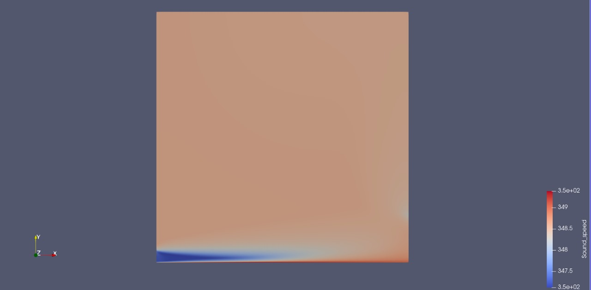

# Assignment 5: Addition of a New Volume Output

This assignment extends our CFD simulation by incorporating a new volume output for the local speed of sound. The goal is to update the simulation setup so that the speed of sound is captured in the history, volume, and screen outputs. This modification helps in better understanding compressible flow behavior within the computational domain.

## Overview

Our simulation is based on a CFD configuration that defines direct, adjoint, and linearized problems using a RANS solver with an SST turbulence model. The simulation is axisymmetric and does not support restart solutions. In this assignment, we add the speed of sound (`SOUND_SPEED`) as an additional output parameter.

## Configuration Updates

To include the speed of sound, the configuration file (`.cfg`) is modified as follows:

- `HISTORY_OUTPUT` is set to include `SOUND_SPEED`.
- `VOLUME_OUTPUT` is set to include `SOUND_SPEED`.
- `SCREEN_OUTPUT` is updated to display `SOUND_SPEED` along with parameters like `INNER_ITER`, `WALL_TIME`, `RMS_DENSITY`, `RMS_NU_TILDE`, `LIFT`, and `DRAG`.

## Code Modifications

The SU2 source code was updated to add the new volume output. In the file (typically `CFlowCompOutput.cpp`), the following lines were inserted:

```cpp
AddVolumeOutput("SOUND_SPEED", "Sound_speed", "PRIMITIVE", "speed of sound"); 
SetVolumeOutputValue("SOUND_SPEED", iPoint, Node_Flow->GetSoundSpeed(Point));
```

These modifications register the `SOUND_SPEED` variable with the output system and assign its computed value for each node during the simulation.

## Rebuild Process

This rebuild process ensures that all code changes, including the new volume output, are properly integrated.

## Visualization with ParaView


